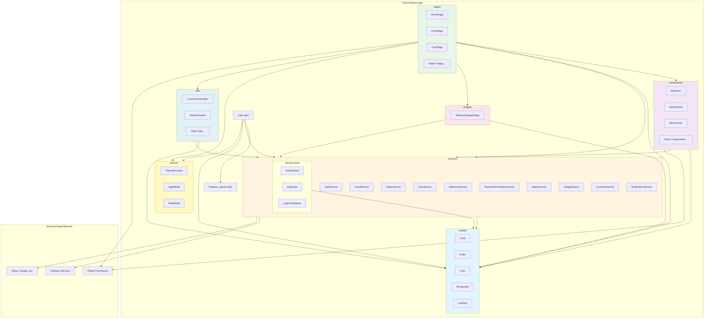

# Biểu Đồ Gói UML (UML Package Diagram) - Hệ Thống Food Delivery

## Mô Tả
Biểu đồ này mô tả cấu trúc các gói (packages) và mối quan hệ phụ thuộc trong hệ thống Food Delivery App.

## Cấu Trúc Gói

### 1. **models** - Mô hình dữ liệu
- `Food` - Mô hình món ăn
- `Order` - Mô hình đơn hàng
- `User` - Mô hình người dùng
- `Restaurant` - Mô hình nhà hàng
- `CartItem` - Mô hình item trong giỏ hàng

### 2. **services** - Dịch vụ nghiệp vụ
- `CartService` - Quản lý giỏ hàng
- `FoodService` - Quản lý món ăn
- `OrderService` - Quản lý đơn hàng
- `UserService` - Quản lý người dùng
- `StatisticsService` - Thống kê
- `PaymentSimulationService` - Mô phỏng thanh toán
- `StripeService` - Tích hợp Stripe
- `ImageService` - Quản lý hình ảnh
- `LocationService` - Dịch vụ vị trí
- `LocationCheckService` - Kiểm tra vị trí
- `DeliveryRangeService` - Phạm vi giao hàng
- `FavoriteService` - Yêu thích
- `NotificationService` - Thông báo
- `FCMService` - Firebase Cloud Messaging

#### **services.auth** - Xác thực
- `AuthService` - Dịch vụ xác thực
- `AuthGate` - Cổng xác thực
- `LoginOrRegister` - Đăng nhập/Đăng ký

### 3. **pages** - Giao diện màn hình
- Trang người dùng: `HomePage`, `FoodPage`, `CartPage`, `ProfilePage`, `MyOrdersPage`, `OrderDetailPage`, `OrderTrackingPage`, `PaymentPage`, `ThankYouPage`, `FavoritesPage`, `SettingsPage`, `NotificationsPage`, `DeliveryInfoPage`, `LocationSelectionPage`
- Trang xác thực: `LoginPage`, `RegisterPage`
- Trang quản trị: `AdminPage`, `AdminDashboardPage`, `AdminProductManagementPage`, `AdminAddFoodPage`, `AdminEditFoodPage`, `AdminOrderManagementPage`, `AdminUserManagementPage`, `AdminStatisticsPage`, `AdminSetupPage`
- Trang khác: `MigrationPage`

### 4. **components** - Thành phần UI tái sử dụng
- `MyButton`, `MyTextField`, `MyFoodTile`, `MyCartTile`, `MyDrawer`, `MyDrawerTile`, `MySliverAppBar`, `MyTabBar`, `MyDescriptionBox`, `MyQuantitySelector`, `MyCurrentLocation`, `CartBadge`, `AuthWidgets`, `UserInfoWidget`

### 5. **widgets** - Widget tùy chỉnh
- `DeliveryRangeDialog`

### 6. **themes** - Giao diện
- `ThemeProvider` - Quản lý theme
- `LightMode` - Chế độ sáng
- `DarkMode` - Chế độ tối

### 7. **utils** - Tiện ích
- `CurrencyFormatter` - Định dạng tiền tệ
- `AdminChecker` - Kiểm tra admin
- `AdminSetup` - Thiết lập admin
- `AuthHelpers` - Trợ giúp xác thực
- `DataMigration` - Di chuyển dữ liệu
- `ImagePlaceholders` - Placeholder hình ảnh
- `SetupRestaurantConfig` - Cấu hình nhà hàng

## Mối Quan Hệ Phụ Thuộc

```
pages → components, models, services, widgets, themes, utils
components → models, services
services → models
widgets → models, services
utils → models, services
main.dart → services, models, themes, firebase_options.dart
```

## Cách Xem Biểu Đồ

### Option 1: PlantUML (Khuyến nghị)
1. Cài đặt PlantUML extension trong VS Code hoặc IDE của bạn
2. Mở file `UML_PACKAGE_DIAGRAM.puml`
3. Xem preview hoặc export sang PNG/SVG

### Option 2: PlantUML Online
1. Truy cập http://www.plantuml.com/plantuml/uml/
2. Copy nội dung từ `UML_PACKAGE_DIAGRAM.puml`
3. Paste vào editor và xem kết quả

### Option 3: Mermaid (Xem bên dưới)
Copy code Mermaid vào https://mermaid.live/ để xem

## Biểu Đồ Mermaid




